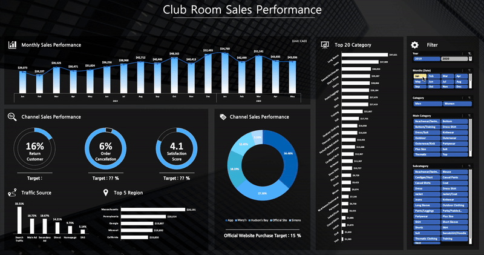
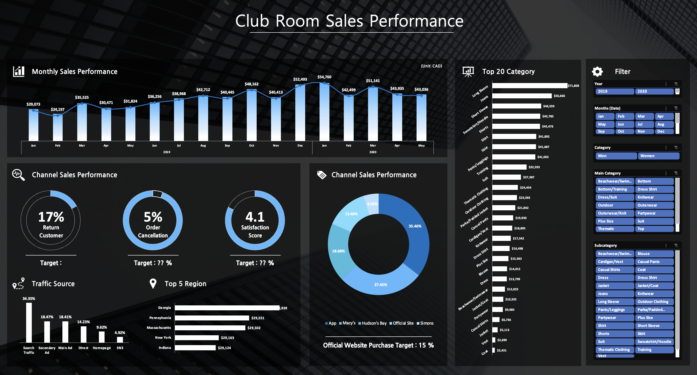

# Online Sales Performance Dashboard

## Overview
This project involves an **Online Sales Performance Dashboard** for a clothing brand. Built using Microsoft Excel, the dashboard provides actionable insights into key sales metrics, product performance, regional trends, and customer satisfaction. The dashboard is designed to support data-driven decision-making for marketing and sales strategies.

---

## Features

- **Sales Overview**
  - Key performance indicators (KPIs) including total sales, total units sold, and average order value.

- **Time Series Analysis**
  - Monthly and yearly sales trends visualized through dynamic line charts.

- **Category Analysis**
  - Breakdown of sales by product category, main category, and subcategory.

- **Regional Sales Insights**
  - Interactive charts showing sales performance across different regions.

- **Channel Performance**
  - Analysis of sales by Sales channel and traffic source.

- **Customer Metrics**
  - Customer satisfaction scores and return rates.

---

## How It Works

1. **Data Input**
   - The source data is stored in the `Sales` sheet, containing detailed sales transactions.

2. **Data Preprocessing**
   - Data cleaning and transformations are performed using **Power Query** in Excel.

3. **Visualization**
   - Pivot tables, slicers, and charts are used to build the interactive dashboard for easy exploration and filtering.

---

## Data Fields

- **Date**: Date of transaction.
- **Region**: Geographical region of the sale.
- **Category**: Gender category.
- **Main Category & Subcategory**: Detailed product classifications.
- **Channel & Traffic Source**: Sales platform and customer traffic origin.
- **Confirmed Sales**: Finalized revenue after returns or cancellations.
- **Satisfaction Score**: Customer feedback rating on a scale.

---

## Files

- `OnlineSales_Dashboard.xlsx`: Contains the raw data, processed data, and interactive dashboard.

---

## Usage

1. Open the `OnlineSales_Dashboard.xlsx` file in Microsoft Excel.
2. Navigate to the **Dashboard** tab for interactive analysis.
3. Use slicers to filter by date, region, category, or channel.
4. Explore trends and metrics to identify actionable insights.

---

## Screenshots

### Sales Overview

---

## Author
**Seunghyun Park**
